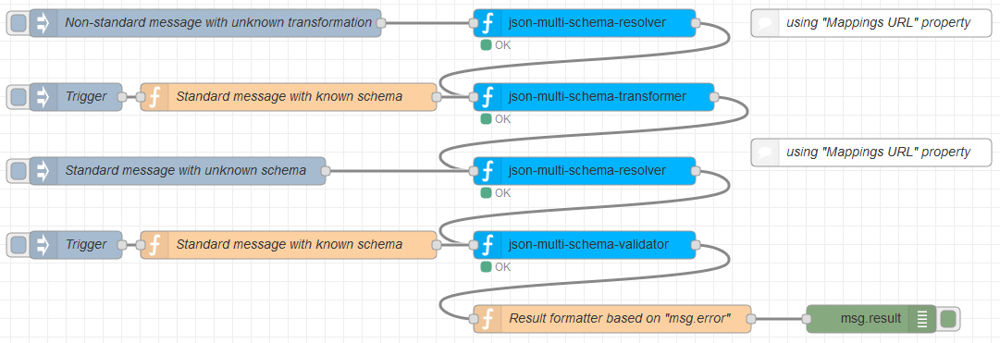

# node-red-contrib-json-multi-schema

Generic Node-RED nodes for a JSON data pipeline, suitable for continuous/streaming input, and with dynamic configuration.


[](https://nodei.co/npm/node-red-contrib-json-multi-schema/)

Three distinct nodes allow transforming, resolving schemas, and validating different types of JSON inputs.

The nodes are made for [Node-RED](https://nodered.org) but can alternatively be [run from command-line](https://github.com/alexandrainst/node-red-contrib-mock-cli) using standard input/output.
Matching rules and transformation rules are written in [JSONata](http://jsonata.org) (JSON query and transformation language), in external files.

Appropriate e.g. for working with [FIWARE](https://www.fiware.org/developers/data-models/)’s [Smart Data Models](https://smart-data-models.github.io/data-models/), but not limited to any model.

Originally made by [Alexandre Alapetite](https://alexandra.dk/alexandre.alapetite) at the [Alexandra Institute](https://alexandra.dk) for the [SynchroniCity European project](https://synchronicity-iot.eu) as a contribution to [FIWARE](https://www.fiware.org). `#AtomicService`

License: [MIT](LICENSE.md), 2019

Requirements: Any platform where [Node-RED](https://nodered.org) (1.0+) or [Node.js](https://nodejs.org) (10.0+) can run.

Here is an example of full Node-RED flow: [Node-RED_example_of_flow.json](examples/Node-RED_example_of_flow.json)




---

## node-red-contrib-json-multi-schema-resolver

* *Context*: Node-RED node, or command line with `node ./index.js json-multi-schema-resolver --mappingsUrl='"https://..."'`
* *Purpose*: Ability to determine the URL of the JSON Schema (e.g. FIWARE NGSI) or JSONata expression to use for a given JSON payload received.
* *Configuration*: A Node-RED `mappingsUrl` property to indicate the URL of a file listing which JSON Schema or JSONata expression to use for which data input. (See examples below).
* *Input*: A JSON observation (e.g. one of the FIWARE NGSI types) in the `msg.payload` property.
* *Output*: The unmodified JSON observation in the `msg.payload` property, and the resolved schema URL in the `msg.schemaUrl` property (if any match was found), and potential resolution errors in the `msg.error` property.

### Example of input data (schema-resolver)

This is an example of [standard payload](https://fiware-datamodels.readthedocs.io/en/latest/Transportation/Vehicle/Vehicle/doc/spec/index.html), for which we need to look-up the [corresponding JSON Schema](https://smart-data-models.github.io/data-models/specs/Transportation/Vehicle/VehicleModel/schema.json).

We represent the example as a full Node-RED message, i.e. wrapped into a `{"payload":...}` structure.

```json
{
	"payload": {
		"id": "vehicle:WasteManagement:1",
		"type": "Vehicle",
		"vehicleType": "lorry",
		"category": ["municipalServices"],
		"location": {
			"type": "Point",
			"coordinates": [40.62785133667262, -3.164485591715449]
		},
		"name": "C Recogida 1",
		"speed": 50,
		"cargoWeight": 314,
		"serviceStatus": "onRoute",
		"serviceProvided": ["garbageCollection", "wasteContainerCleaning"],
		"areaServed": "Centro",
		"refVehicleModel": "vehiclemodel:econic",
		"vehiclePlateIdentifier": "3456ABC"
	}
}
```

### Example of configuration file listing the JSON schemas

In the example, this JSON file is hosted at [`examples/smart-data-models.json`](https://raw.githubusercontent.com/alexandrainst/node-red-contrib-json-multi-schema/main/examples/smart-data-models.json)

`query` is a [JSONata expression](http://docs.jsonata.org/simple). In this example, it will match the input data above on `"type":"Vehicle"`

```json
[
	{
		"query": "type",
		"cases": {
			"AeroAllergenObserved": "https://smart-data-models.github.io/data-models/specs/Environment/AeroAllergenObserved/schema.json",
			...
			"NoiseLevelObserved": "https://smart-data-models.github.io/data-models/specs/Environment/NoiseLevelObserved/schema.json",
			"Vehicle": "https://smart-data-models.github.io/data-models/specs/Transportation/Vehicle/Vehicle/schema.json",
			"WasteContainer": "https://smart-data-models.github.io/data-models/specs/WasteManagement/WasteContainer/schema.json",
		}
	},
	{
		"query": "...",
		"cases": {
			...
		}
	}
]
```

### Example of configuration file listing the JSONata transformations

Same format than above.
In the example, this JSON file is hosted at [`examples/smart-data-transforms.json`](https://raw.githubusercontent.com/alexandrainst/node-red-contrib-json-multi-schema/main/examples/smart-data-transforms.json)

`query` is a [JSONata expression](http://docs.jsonata.org/simple).

```json
[
	{
		"description": "Transformation from NGSI v2 models from 'Normalized response representation' to 'Simplified representation'",
		"query": "type and *.value",
		"cases": {
			"true": "https://raw.githubusercontent.com/alexandrainst/node-red-contrib-json-multi-schema/main/examples/NGSI-Normalised-to-keyValues.jsonata.js"
		}
	},
	{
		"description": "Transformation from Cesva-TA120 to NGSI v2 NoiseLevelObserved in Simplified representation",
		"query": "type='Cesva-TA120' and NoiseLevelObserved",
		"cases": {
			"true": "https://raw.githubusercontent.com/alexandrainst/node-red-contrib-json-multi-schema/main/examples/Cesva-TA120-to-NoiseLevelObserved.jsonata.js"
		}
	}
]
```

### Example of schema resolution from command line

The JSON input messages must each be on one single line, and wrapped into a Node-RED structure `{"payload":...}`
See the `jq` examples at the bottom on how to automatise the wrapping.

```sh
echo '{"payload":{"id":"vehicle:WasteManagement:1","type":"Vehicle","vehicleType":"lorry","category":["municipalServices"],"location":{"type":"Point","coordinates":[40.62785133667262,-3.164485591715449]},"name":"C Recogida 1","speed":50,"cargoWeight":314,"serviceStatus":"onRoute","serviceProvided":["garbageCollection","wasteContainerCleaning"],"areaServed":"Centro","refVehicleModel":"vehiclemodel:econic","vehiclePlateIdentifier":"3456ABC"}}' | \
node ./index.js json-multi-schema-resolver --mappingsUrl='"https://raw.githubusercontent.com/alexandrainst/node-red-contrib-json-multi-schema/main/examples/smart-data-models.json"' | \
jq .
```

Output:

```json
{
	"payload": {
		"id": "vehicle:WasteManagement:1",
		"type": "Vehicle",
		"vehicleType": "lorry",
		"category": [
			"municipalServices"
		],
		"location": {
			"type": "Point",
			"coordinates": [
				40.62785133667262,
				-3.164485591715449
			]
		},
		"name": "C Recogida 1",
		"speed": 50,
		"cargoWeight": 314,
		"serviceStatus": "onRoute",
		"serviceProvided": [
			"garbageCollection",
			"wasteContainerCleaning"
		],
		"areaServed": "Centro",
		"refVehicleModel": "vehiclemodel:econic",
		"vehiclePlateIdentifier": "3456ABC"
	},
	"error": false,
	"schemaUrl": "https://smart-data-models.github.io/data-models/specs/Transportation/Vehicle/Vehicle/schema.json"
}
```

---

## node-red-contrib-json-multi-schema-transformer

* *Context*: Node-RED node, or command line with `node ./index.js multi-schema-transformer`
* *Purpose*: Ability to transform a JSON observation on the fly from whichever format to another format (e.g. one of the FIWARE NGSI types) using a specified JSONata URL. Schemas are automatically downloaded and cached the first time they are needed.
* *Input*: A JSON observation in whichever format in the `msg.payload` property, and the corresponding JSONata URL on the `msg.schemaUrl` property (coming from json-multi-schema-resolver).
  * Alternatively, a static default value for the schema URL can be set in the corresponding property.
  * If no `msg.schemaUrl` is provided, and no value set in the default schema URL property, then no transformation is performed.
* *Output*: The transformed JSON observation in the `msg.payload` property, the used JSONata in the `msg.transformUrl` (if any transformation was performed), and potential validation errors in the `msg.error` property.
* *Implementation*: Based on [JSONata](https://github.com/jsonata-js/jsonata).

It is typically used with a *json-multi-schema-resolver* node in front.

### Example of input data (schema-transformer)

This is an example of proprietary format, which we would like to transform into another format (a standard NGSI one).

We represent the example as a full Node-RED message, i.e. wrapped into a `{"payload":...}` structure.

```json
{
	"payload": {
		"id": "TA120-T246177",
		"type": "Cesva-TA120",
		"NoiseLevelObserved": {
			"id": "TA120-T246177-NoiseLevelObserved-2018-09-17T07:01:09.000000Z",
			"sonometerClass": "1",
			"location": {
				"coordinates": [
					24.985891,
					60.274286
				],
				"type": "Point"
			},
			"measurand": [
				"LAeq | 48.6 | A-weighted, equivalent, sound level"
			],
			"dateObserved": "2018-09-17T07:01:09.000000Z",
			"LAeq": 48.6,
			"type": "NoiseLevelObserved"
		}
	}
}
```

### Example of JSONata transformation

In the example, this JSONata file is hosted at [`Cesva-TA120-to-NoiseLevelObserved.jsonata.js`](https://raw.githubusercontent.com/alexandrainst/node-red-contrib-json-multi-schema/main/examples/Cesva-TA120-to-NoiseLevelObserved.jsonata.js).

```js
{
	"id": NoiseLevelObserved.id,
	"type": NoiseLevelObserved.type,
	"LAeq": NoiseLevelObserved.LAeq,
	"dateObservedFrom": NoiseLevelObserved.dateObserved,
	"dateObservedTo": NoiseLevelObserved.dateObserved,
	"location": NoiseLevelObserved.location
}

```

A more advanced example of JSONata transformation can be found in [`NGSI-Normalised-to-keyValues.jsonata.js`](https://raw.githubusercontent.com/alexandrainst/node-red-contrib-json-multi-schema/main/examples/NGSI-Normalised-to-keyValues.jsonata.js).

### Example of transformation from command line

The JSON input messages must each be on one single line, and wrapped into a Node-RED structure `{"payload":...}`

```sh
echo '{"payload":{"id":"TA120-T246177","type":"Cesva-TA120","NoiseLevelObserved":{"id":"TA120-T246177-NoiseLevelObserved-2018-09-17T07:01:09.000000Z","sonometerClass":"1","location":{"coordinates":[24.985891,60.274286],"type":"Point"},"measurand":["LAeq | 48.6 | A-weighted, equivalent, sound level"],"dateObserved":"2018-09-17T07:01:09.000000Z","LAeq":48.6,"type":"NoiseLevelObserved"}},"error":false,"schemaUrl":"https://raw.githubusercontent.com/alexandrainst/node-red-contrib-json-multi-schema/main/examples/Cesva-TA120-to-NoiseLevelObserved.jsonata.js"}' | \
node ./index.js json-multi-schema-transformer | \
jq .
```

Same example, but using a static default value for the schema URL in the corresponding property:

```sh
echo '{"payload":{"id":"TA120-T246177","type":"Cesva-TA120","NoiseLevelObserved":{"id":"TA120-T246177-NoiseLevelObserved-2018-09-17T07:01:09.000000Z","sonometerClass":"1","location":{"coordinates":[24.985891,60.274286],"type":"Point"},"measurand":["LAeq | 48.6 | A-weighted, equivalent, sound level"],"dateObserved":"2018-09-17T07:01:09.000000Z","LAeq":48.6,"type":"NoiseLevelObserved"}},"error":false}' | \
node ./index.js json-multi-schema-transformer --defaultSchemaUrl='"https://raw.githubusercontent.com/alexandrainst/node-red-contrib-json-multi-schema/main/examples/Cesva-TA120-to-NoiseLevelObserved.jsonata.js"' | \
jq .
```

Output:

```json
{
	"payload": {
		"id": "TA120-T246177-NoiseLevelObserved-2018-09-17T07:01:09.000000Z",
		"type": "NoiseLevelObserved",
		"LAeq": 48.6,
		"dateObservedFrom": "2018-09-17T07:01:09.000000Z",
		"dateObservedTo": "2018-09-17T07:01:09.000000Z",
		"location": {
			"coordinates": [
				24.985891,
				60.274286
			],
			"type": "Point"
		}
	},
	"error": false,
	"transformUrl": "https://raw.githubusercontent.com/alexandrainst/node-red-contrib-json-multi-schema/main/examples/Cesva-TA120-to-NoiseLevelObserved.jsonata.js"
}
```

---

## node-red-contrib-json-multi-schema-validator

* *Context*: Node-RED node, or command line with `node ./index.js json-multi-schema-validator`
* *Purpose*: Ability to validate a JSON observation (e.g. one of the FIWARE NGSI types) on the fly against a specified JSON Schema URL. Schemas are automatically downloaded and cached the first time they are needed.
* *Configuration*: A `schemaVersion` property indicating which [version of JSON Schema version](http://json-schema.org/specification.html). See the [Ajv documentation](https://ajv.js.org/json-schema.html#json-schema-versions) for technical details.
* *Input*: A JSON observation (e.g. one of the FIWARE NGSI types) in the `msg.payload` property, and the corresponding JSON Schema URL on the `msg.schemaUrl` property (coming from json-multi-schema-resolver).
  * If no `msg.schemaUrl` is provided, no validation is performed.
* *Output*: The unmodified JSON observation in the `msg.payload` property, the used schema in the `msg.validUrl` (if any validation was performed), and potential validation errors in the `msg.error` property.
* *Implementation*: Based on [AJV](https://ajv.js.org).

It is typically used with a *json-multi-schema-resolver* node in front.

### Example of input data (schema-validator)

This is an example of [standard payload](https://fiware-datamodels.readthedocs.io/en/latest/Environment/NoiseLevelObserved/doc/spec/index.html#noise-level-observed), which we want to validate against its [corresponding JSON Schema](https://smart-data-models.github.io/data-models/specs/Environment/NoiseLevelObserved/schema.json), which address is provided by the Node-RED property `msg.schemaUrl`.

```json
{
	"payload": {
		"id": "TA120-T246177-NoiseLevelObserved-2018-09-17T07:01:09.000000Z",
		"type": "NoiseLevelObserved",
		"LAeq": 48.6,
		"dateObservedFrom": "2018-09-17T07:01:09.000000Z",
		"dateObservedTo": "2018-09-17T07:01:09.000000Z",
		"location": {
			"coordinates": [
				24.985891,
				60.274286
			],
			"type": "Point"
		}
	},
	"schemaUrl": "https://smart-data-models.github.io/data-models/specs/Environment/NoiseLevelObserved/schema.json"
}
```

### Example of JSON Schema validation from command line

The JSON input messages must each be on one single line, and wrapped into a Node-RED structure `{"payload":...}`

```sh
echo '{"payload":{"id":"TA120-T246177-NoiseLevelObserved-2018-09-17T07:01:09.000000Z","type":"NoiseLevelObserved","LAeq":48.6,"dateObservedFrom":"2018-09-17T07:01:09.000000Z","dateObservedTo":"2018-09-17T07:01:09.000000Z","location":{"coordinates":[24.985891,60.274286],"type":"Point"}},"error":false,"transformUrl":"https://raw.githubusercontent.com/alexandrainst/node-red-contrib-json-multi-schema/main/examples/Cesva-TA120-to-NoiseLevelObserved.jsonata.js","schemaUrl":"https://smart-data-models.github.io/data-models/specs/Environment/NoiseLevelObserved/schema.json"}' | \
node ./index.js json-multi-schema-validator --schemaVersion='\"draft-2019-09\"' | \
jq .
```

Output:

```json
{
	"payload": {
		"id": "TA120-T246177-NoiseLevelObserved-2018-09-17T07:01:09.000000Z",
		"type": "NoiseLevelObserved",
		"LAeq": 48.6,
		"dateObservedFrom": "2018-09-17T07:01:09.000000Z",
		"dateObservedTo": "2018-09-17T07:01:09.000000Z",
		"location": {
			"coordinates": [
				24.985891,
				60.274286
			],
			"type": "Point"
		}
	},
	"error": false,
	"validUrl": "https://smart-data-models.github.io/data-models/specs/Environment/NoiseLevelObserved/schema.json"
}
```

---

## Wiring/Piping all modules together

The three modules above may be used independently or in combination.
Here is an example of JSON transformation, followed by a schema resolver, and finally a JSON Schema validation.

### Wiring in Node-RED

Cf. screenshot at the top of this document.

### Piping on command line

```sh
printf '{"payload":{"id":"TA120-T246177","type":"Cesva-TA120","NoiseLevelObserved":{"id":"TA120-T246177-NoiseLevelObserved-2018-09-17T07:01:09.000000Z","sonometerClass":"1","location":{"coordinates":[24.985891,60.274286],"type":"Point"},"measurand":["LAeq | 48.6 | A-weighted, equivalent, sound level"],"dateObserved":"2018-09-17T07:01:09.000000Z","LAeq":48.6,"type":"NoiseLevelObserved"}}} \n {"payload":{"id":"TA120-T246183","type":"Cesva-TA120","NoiseLevelObserved":{"id":"TA120-T246183-NoiseLevelObserved-2018-09-17T07:01:15.000000Z","sonometerClass":"1","location":{"coordinates":[24.9030921,60.161804],"type":"Point"},"measurand":["LAeq | 37.6 | A-weighted, equivalent, sound level"],"dateObserved":"2018-09-17T07:01:15.000000Z","LAeq":37.6,"type":"NoiseLevelObserved"}}}' | \
node ./index.js json-multi-schema-resolver --mappingsUrl='"https://raw.githubusercontent.com/alexandrainst/node-red-contrib-json-multi-schema/main/examples/smart-data-transforms.json"' | \
node ./index.js json-multi-schema-transformer | \
node ./index.js json-multi-schema-resolver --mappingsUrl='"https://raw.githubusercontent.com/alexandrainst/node-red-contrib-json-multi-schema/main/examples/smart-data-models.json"' | \
node ./index.js json-multi-schema-validator | \
jq .
```

_Note_: This is the example used for `npm test`

The CLI functionnality is provided by [*node-red-contrib-mock-cli*](https://github.com/alexandrainst/node-red-contrib-mock-cli).

### JSON in Node-RED format

[`jq`](https://stedolan.github.io/jq/) may be used to break down and format a standard payload into a Node-RED payload:

For instance if the input is a list of observations wrapped into a JSON array:

```sh
jq -c '.[] | {"payload":.}'
```

Example from an URL, doing a transformation followed by a validation:

```sh
curl 'https://broker.fiware.urbanplatform.portodigital.pt/v2/entities?limit=10' | \
jq -c '.[] | {"payload":.}' | \
node ./index.js json-multi-schema-resolver --mappingsUrl='"https://raw.githubusercontent.com/alexandrainst/node-red-contrib-json-multi-schema/main/examples/smart-data-transforms.json"' | \
node ./index.js json-multi-schema-transformer | \
node ./index.js json-multi-schema-resolver --mappingsUrl='"https://raw.githubusercontent.com/alexandrainst/node-red-contrib-json-multi-schema/main/examples/smart-data-models.json"' | \
node ./index.js json-multi-schema-validator | \
jq -c .
```

---

## Docker

* [](https://hub.docker.com/repository/docker/synchronicityiot/node-red-contrib-json-multi-schema)

### Build

```sh
docker build --tag synchronicityiot/node-red-contrib-json-multi-schema .
```

### Persistant cache

To allow keeping a local copy of the remote JSON configuration files, transformations, and schemas.

```sh
docker volume create tmp-schemas
```

### Run

```sh
docker run -v tmp-schemas:/tmp --rm synchronicityiot/node-red-contrib-json-multi-schema [name-of-node] --parameter='...'
```


Example for resolving and validating from a network HTTP request:

```sh
curl 'https://broker.fiware.urbanplatform.portodigital.pt/v2/entities?limit=10' | \
jq -c '.[] | {"payload":.}' | \
docker run -i -v tmp-schemas:/tmp --rm synchronicityiot/node-red-contrib-json-multi-schema json-multi-schema-resolver --mappingsUrl='"https://raw.githubusercontent.com/alexandrainst/node-red-contrib-json-multi-schema/main/examples/smart-data-transforms.json"' | \
docker run -i -v tmp-schemas:/tmp --rm synchronicityiot/node-red-contrib-json-multi-schema json-multi-schema-transformer | \
docker run -i -v tmp-schemas:/tmp --rm synchronicityiot/node-red-contrib-json-multi-schema json-multi-schema-resolver --mappingsUrl='"https://raw.githubusercontent.com/alexandrainst/node-red-contrib-json-multi-schema/main/examples/smart-data-models.json"' | \
docker run -i -v tmp-schemas:/tmp --rm synchronicityiot/node-red-contrib-json-multi-schema json-multi-schema-validator | \
jq -c .
```

---

## Serving schemas

The three nodes are all expecting configuration files and corresponding schemas to be provided by HTTP.

While JSON Schemas are often publicly available (e.g. <https://schema.org> , <https://smart-data-models.github.io/data-models/> ), it might not be the case for the list of JSON Schemas itself, the list of transformations, or the JSONata transformations.

Any HTTP server can be used to host those documents. This can also be done using Node-RED:

### Local Node-RED hosting

The same Node-RED instance can be used to host the various lists and custom schemas, which are then accessible via `http://localhost:1880/*`

Here is an example of full Node-RED flow: [Node-RED_example_of_HTTP_flow.json](examples/Node-RED_example_of_HTTP_flow.json)


In this example, the schemas are published at `http://localhost:1880/schemas/example.json` where `example.json` is the filename.

Read more on the [Node-RED cookbook](https://cookbook.nodered.org/http/serve-json-content).

---

## Caching of schemas

A disk copy of the downloaded JSON and JSONata documents is kept in cache on disk.
There is a distinct disk cache copy for each node instance.

By default, the cache path is `/tmp/` but that can be changed with the environment variable `SCHEMAS_CACHE_PATH`
Cached files have a `schema.[URL hash].[Node ID].tmp.js` format.

If schemas are updated without changing their URL, it is possible to either alter the URL slightly (like `https://example.net/a-schema.json?v2`), delete and recreate the node (so that the node gets a new ID), or purge the local disk cache manually (in which case it is necessary to restart Node-RED to clear the memory cache).
