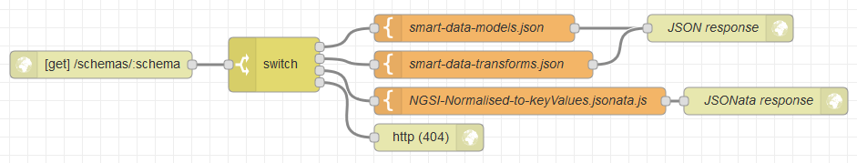

# node-red-contrib-json-multi-schema
Set of generic JSON data pipeline tools, suitable for continuous/streaming input, and with dynamic configuration.

Three distinct nodes allow transforming, resolving schemas, and validating different types of JSON inputs.

The nodes are made for [Node-RED](https://nodered.org) but can alternatively be run from command-line using standard input/output.
Matching rules and transformation rules are written in [JSONata](http://jsonata.org) (JSON query and transformation language), in external files.

Appropriate e.g. for working with [FIWARE](https://www.fiware.org/developers/data-models/)’s [Smart Data Models](https://smart-data-models.github.io/data-models/),
but not limited to any model.

Made by [Alexandre Alapetite](https://alexandra.dk/alexandre.alapetite) at the [Alexandra Institute](https://alexandra.dk) for the [SynchroniCity European project](https://synchronicity-iot.eu) as a contribution to [FIWARE](https://www.fiware.org). `#AtomicService`

License: [MIT](LICENSE.md), 2019

Requirements: Any platform where [Node-RED](https://nodered.org) (1.0+) or [Node.js](https://nodejs.org) (10.0+) can run.

Here is an example of full Node-RED flow: [Node-RED_example_of_flow.json](examples/Node-RED_example_of_flow.json)


 

---

 

## node-red-contrib-json-multi-schema-transformer
* *Context*: Node-RED node, or command line with `index.js multi-schema-transformer --transformsUrl='"https://..."'`
* *Purpose*: Ability to transform a JSON observation on the fly from whichever format to another format (e.g. one of the FIWARE NGSI types) using a specified JSONata URL. Schemas are automatically downloaded and cached the first time they are needed.
* *Configuration*: A Node-RED `transformsUrl` property to indicate the URL of a file listing which JSONata file to use for which data input. (See example below).
* *Input*: A JSON observation in whichever format in the `msg.payload` property.
* *Output*: The transformed JSON observation in the `msg.payload` property.

### Example of input data

This is an example of non-standard payload, which needs to be transformed into a standard format.

We represent the example as a full Node-RED message, i.e. wrapped into a `{"payload":...}` structure (cf. `jq` version further down).

```json
{
	"payload": {
		"id": "vehicle:WasteManagement:1",
		"type": "BasicVehicle",
		"vehicleType": "lorry",
		"category1": "municipalServices",
		"latitude": -3.164485591715449,
		"longitude": 40.62785133667262,
		"name": "C Recogida 1",
		"speed": 50,
		"cargoWeight": 314,
		"serviceStatus": "onRoute",
		"serviceProvided1": "garbageCollection",
		"serviceProvided2": "wasteContainerCleaning",
		"areaServed": "Centro",
		"refVehicleModel": "vehiclemodel:econic",
		"vehiclePlateIdentifier": "3456ABC"
	}
}
```

### Example of configuration file listing the transformations

In the example, this JSON file is hosted at `https://raw.githubusercontent.com/alexandrainst/node-red-contrib-json-multi-schema/master/examples/smart-data-transforms.json`

`query` is a [JSONata expression](http://docs.jsonata.org/simple). In this example, it will match the input data above.

```json
[
	{
		"description": "Transformation from NGSI v2 models from 'Normalized response representation' (JSON-LD version partially supported) to 'Simplified representation'",
		"query": "type and *.value",
		"cases": {
			"true": "https://raw.githubusercontent.com/alexandrainst/node-red-contrib-json-multi-schema/master/examples/NGSI-Normalised-to-keyValues.jsonata.js"
		}
	},
	{
		"description": "Transformation from Cesva-TA120 to NGSI v2 NoiseLevelObserved in Simplified representation",
		"query": "type='Cesva-TA120' and NoiseLevelObserved",
		"cases": {
			"true": "https://raw.githubusercontent.com/alexandrainst/node-red-contrib-json-multi-schema/master/examples/Cesva-TA120-to-NoiseLevelObserved.jsonata.js"
		}
	}
]
```

### Example of JSONata transformation

In the example, this JSONata file is hosted at [`Cesva-TA120-to-NoiseLevelObserved.jsonata.js`](https://raw.githubusercontent.com/alexandrainst/node-red-contrib-json-multi-schema/master/examples/Cesva-TA120-to-NoiseLevelObserved.jsonata.js).

```js
{
	"id": NoiseLevelObserved.id,
	"type": NoiseLevelObserved.type,
	"LAeq": NoiseLevelObserved.LAeq,
	"dateObservedFrom": NoiseLevelObserved.dateObserved,
	"dateObservedTo": NoiseLevelObserved.dateObserved,
	"location": NoiseLevelObserved.location
}

```

A more advanced example of JSONata transformation can be found in [`NGSI-Normalised-to-keyValues.jsonata.js`](https://raw.githubusercontent.com/alexandrainst/node-red-contrib-json-multi-schema/master/examples/NGSI-Normalised-to-keyValues.jsonata.js).

### Example of transformation from command line
The JSON input messages must each be on one single line, and wrapped into a Node-RED structure `{"payload":...}`

```sh
echo '{"payload":{"id":"TA120-T246177","type":"Cesva-TA120","NoiseLevelObserved":{"id":"TA120-T246177-NoiseLevelObserved-2018-09-17T07:01:09.000000Z","sonometerClass":"1","location":{"coordinates":[24.985891,60.274286],"type":"Point"},"measurand":["LAeq | 48.6 | A-weighted, equivalent, sound level"],"dateObserved":"2018-09-17T07:01:09.000000Z","LAeq":48.6,"type":"NoiseLevelObserved"}}}' | \
node ./index.js json-multi-schema-transformer --transformsUrl='"https://raw.githubusercontent.com/alexandrainst/node-red-contrib-json-multi-schema/master/examples/smart-data-transforms.json"' | jq .
```

Output:

```json
{
	"payload": {
		"id": "TA120-T246177-NoiseLevelObserved-2018-09-17T07:01:09.000000Z",
		"type": "NoiseLevelObserved",
		"LAeq": 48.6,
		"dateObservedFrom": "2018-09-17T07:01:09.000000Z",
		"dateObservedTo": "2018-09-17T07:01:09.000000Z",
		"location": {
			"coordinates": [
				24.985891,
				60.274286
			],
			"type": "Point"
		}
	},
	"error": false,
	"transformUrl": "https://raw.githubusercontent.com/alexandrainst/node-red-contrib-json-multi-schema/master/examples/Cesva-TA120-to-NoiseLevelObserved.jsonata.js"
}
```

 

---

 

## node-red-contrib-json-multi-schema-resolver
* *Context*: Node-RED node, or command line with `./index.js json-multi-schema-resolver --mappingsUrl='"https://..."'`
* *Purpose*: Ability to determine the URL of the JSON Schema (e.g. FIWARE NGSI) to use for a given JSON payload received.
* *Configuration*: A Node-RED `mappingsUrl` property to indicate the URL of a file listing which JSON Schema to use for which data input. (See example below).
* *Input*: A JSON observation (e.g. one of the FIWARE NGSI types) in the `msg.payload` property.
* *Output*: The unmodified JSON observation in the `msg.payload` property, and the resolved schema URL in the `msg.schemaUrl` property.

### Example of input data
This is an example of [standard payload](https://fiware-datamodels.readthedocs.io/en/latest/Transportation/Vehicle/Vehicle/doc/spec/index.html), for which we need to look-up the [corresponding JSON Schema](https://smart-data-models.github.io/data-models/specs/Transportation/Vehicle/VehicleModel/schema.json).

We represent the example as a full Node-RED message, i.e. wrapped into a `{"payload":...}` structure.

```json
{
	"payload": {
		"id": "vehicle:WasteManagement:1",
		"type": "Vehicle",
		"vehicleType": "lorry",
		"category": ["municipalServices"],
		"location": {
			"type": "Point",
			"coordinates": [40.62785133667262, -3.164485591715449]
		},
		"name": "C Recogida 1",
		"speed": 50,
		"cargoWeight": 314,
		"serviceStatus": "onRoute",
		"serviceProvided": ["garbageCollection", "wasteContainerCleaning"],
		"areaServed": "Centro",
		"refVehicleModel": "vehiclemodel:econic",
		"vehiclePlateIdentifier": "3456ABC"
	}
}
```

### Example of configuration file listing the JSON schemas

In the example, this JSON file is hosted at `https://raw.githubusercontent.com/alexandrainst/node-red-contrib-json-multi-schema/master/examples/smart-data-models.json`

`query` is a [JSONata expression](http://docs.jsonata.org/simple). In this example, it will match the input data above on `"type":"Vehicle"`

```json
[
	{
		"query": "type",
		"cases": {
			"AeroAllergenObserved": "https://smart-data-models.github.io/data-models/specs/Environment/AeroAllergenObserved/schema.json",
			...
			"Vehicle": "https://smart-data-models.github.io/data-models/specs/Transportation/Vehicle/Vehicle/schema.json",
			"WasteContainer": "https://smart-data-models.github.io/data-models/specs/WasteManagement/WasteContainer/schema.json",
		}
	},
	{
		"query": "...",
		"cases": {
			...
		}
	}
]
```

### Example of schema resolution from command line
The JSON input messages must each be on one single line, and wrapped into a Node-RED structure `{"payload":...}`

```sh
echo '{"payload":{"id":"vehicle:WasteManagement:1","type":"Vehicle","vehicleType":"lorry","category":["municipalServices"],"location":{"type":"Point","coordinates":[40.62785133667262,-3.164485591715449]},"name":"C Recogida 1","speed":50,"cargoWeight":314,"serviceStatus":"onRoute","serviceProvided":["garbageCollection","wasteContainerCleaning"],"areaServed":"Centro","refVehicleModel":"vehiclemodel:econic","vehiclePlateIdentifier":"3456ABC"}}' | \
node ./index.js json-multi-schema-resolver --mappingsUrl='"https://raw.githubusercontent.com/alexandrainst/node-red-contrib-json-multi-schema/master/examples/smart-data-models.json"' | jq .
```

Output:

```json
{
	"payload": {
		"id": "vehicle:WasteManagement:1",
		"type": "Vehicle",
		"vehicleType": "lorry",
		"category": [
			"municipalServices"
		],
		"location": {
			"type": "Point",
			"coordinates": [
				40.62785133667262,
				-3.164485591715449
			]
		},
		"name": "C Recogida 1",
		"speed": 50,
		"cargoWeight": 314,
		"serviceStatus": "onRoute",
		"serviceProvided": [
			"garbageCollection",
			"wasteContainerCleaning"
		],
		"areaServed": "Centro",
		"refVehicleModel": "vehiclemodel:econic",
		"vehiclePlateIdentifier": "3456ABC"
	},
	"error": false,
	"schemaUrl": "https://smart-data-models.github.io/data-models/specs/Transportation/Vehicle/Vehicle/schema.json"
}
```

 

---

 

## node-red-contrib-json-multi-schema-validator
* *Context*: Node-RED node, or command line with `./index.js json-multi-schema-validator`
* *Purpose*: Ability to validate a JSON observation (e.g. one of the FIWARE NGSI types) on the fly against a specified JSON Schema URL. Schemas are automatically downloaded and cached the first time they are needed.
* *Input*: A JSON observation (e.g. one of the FIWARE NGSI types) in the `msg.payload` property, and the corresponding JSON Schema URL on the `msg.schemaUrl` property.
* *Output*: The unmodified JSON observation in the `msg.payload` property, and potential validation errors in the `msg.error` property.
* *Implementation*: Based on [AJV](https://ajv.js.org).

### Example of input data
This is an example of [standard payload](https://fiware-datamodels.readthedocs.io/en/latest/Transportation/Vehicle/Vehicle/doc/spec/index.html), which we want to validate against its [corresponding JSON Schema](https://smart-data-models.github.io/data-models/specs/Transportation/Vehicle/VehicleModel/schema.json), which address is provided by the Node-RED property `msg.schemaUrl`.

```json
{
	"payload": {
		"id": "vehicle:WasteManagement:1",
		"type": "Vehicle",
		"vehicleType": "lorry",
		"category": ["municipalServices"],
		"location": {
			"type": "Point",
			"coordinates": [40.62785133667262, -3.164485591715449]
		},
		"name": "C Recogida 1",
		"speed": 50,
		"cargoWeight": 314,
		"serviceStatus": "onRoute",
		"serviceProvided": ["garbageCollection", "wasteContainerCleaning"],
		"areaServed": "Centro",
		"refVehicleModel": "vehiclemodel:econic",
		"vehiclePlateIdentifier": "3456ABC"
	},
	"schemaUrl": "https://smart-data-models.github.io/data-models/specs/Transportation/Vehicle/Vehicle/schema.json"
}
```

### Example of JSON Schema validation from command line
The JSON input messages must each be on one single line, and wrapped into a Node-RED structure `{"payload":...}`

```sh
echo '{"payload":{"id":"vehicle:WasteManagement:1","type":"Vehicle","vehicleType":"lorry","category":["municipalServices"],"location":{"type":"Point","coordinates":[40.62785133667262,-3.164485591715449]},"name":"C Recogida 1","speed":50,"cargoWeight":314,"serviceStatus":"onRoute","serviceProvided":["garbageCollection","wasteContainerCleaning"],"areaServed":"Centro","refVehicleModel":"vehiclemodel:econic","vehiclePlateIdentifier":"3456ABC"},"schemaUrl":"https://smart-data-models.github.io/data-models/specs/Transportation/Vehicle/Vehicle/schema.json"}' | \
node ./index.js json-multi-schema-validator | jq .
```

Output:

```json
{
	"payload": {
		"id": "vehicle:WasteManagement:1",
		"type": "Vehicle",
		"vehicleType": "lorry",
		"category": [
			"municipalServices"
		],
		"location": {
			"type": "Point",
			"coordinates": [
				40.62785133667262,
				-3.164485591715449
			]
		},
		"name": "C Recogida 1",
		"speed": 50,
		"cargoWeight": 314,
		"serviceStatus": "onRoute",
		"serviceProvided": [
			"garbageCollection",
			"wasteContainerCleaning"
		],
		"areaServed": "Centro",
		"refVehicleModel": "vehiclemodel:econic",
		"vehiclePlateIdentifier": "3456ABC"
	},
	"schemaUrl": "https://smart-data-models.github.io/data-models/specs/Transportation/Vehicle/Vehicle/schema.json",
	"error": false
}
```

 

---

 

## Wiring/Piping all modules together
The three modules above may be used independently or in combination.
Here is an example of JSON transformation, followed by a schema resolver, and finally a JSON Schema validation.

### Wiring in Node-RED
Cf. screenshot at the top of this document.

### Piping on command line
```sh
echo '{"payload":{"id":"TA120-T246177","type":"Cesva-TA120","NoiseLevelObserved":{"id":"TA120-T246177-NoiseLevelObserved-2018-09-17T07:01:09.000000Z","sonometerClass":"1","location":{"coordinates":[24.985891,60.274286],"type":"Point"},"measurand":["LAeq | 48.6 | A-weighted, equivalent, sound level"],"dateObserved":"2018-09-17T07:01:09.000000Z","LAeq":48.6,"type":"NoiseLevelObserved"}}}' | \
node ./index.js json-multi-schema-transformer --transformsUrl='"https://raw.githubusercontent.com/alexandrainst/node-red-contrib-json-multi-schema/master/examples/smart-data-transforms.json"' | \
node ./index.js json-multi-schema-resolver --mappingsUrl='"https://raw.githubusercontent.com/alexandrainst/node-red-contrib-json-multi-schema/master/examples/smart-data-models.json"' | \
node ./index.js json-multi-schema-validator | jq .
```

_Note_: This is the example used for `npm test`

### JSON in Node-RED format
[`jq`](https://stedolan.github.io/jq/) may be used to break down and format a standard payload into a Node-RED payload:

For instance if the input is a list of observations wrapped into a JSON array:

```sh
jq -c '.[] | {"payload":.}'
```

Example from an URL:

```sh
curl 'https://broker.fiware.urbanplatform.portodigital.pt/v2/entities?limit=10' | \
jq -c '.[] | {"payload":.}' | \
node ./index.js json-multi-schema-transformer --transformsUrl='"https://raw.githubusercontent.com/alexandrainst/node-red-contrib-json-multi-schema/master/examples/smart-data-transforms.json"' | \
node ./index.js json-multi-schema-resolver --mappingsUrl='"https://raw.githubusercontent.com/alexandrainst/node-red-contrib-json-multi-schema/master/examples/smart-data-models.json"' | \
node ./index.js json-multi-schema-validator | \
jq -c .
```

 

---

 

## Caching

A disk copy of the downloaded JSON and JSONata documents is kept in cache on disk.
By default, the cache path is `/tmp/` but that can be changed with the environment variable `SCHEMAS_CACHE_PATH`

 

---

 

## Docker

* [](https://hub.docker.com/repository/docker/synchronicityiot/node-red-contrib-json-multi-schema)

### Build

```sh
docker build --tag synchronicityiot/node-red-contrib-json-multi-schema .
```

### Persistant cache
To allow keeping a local copy of the remote JSON configuration files, transformations, and schemas.

```sh
docker volume create tmp-schemas
```

### Run

```sh
docker run -v tmp-schemas:/tmp --rm synchronicityiot/node-red-contrib-json-multi-schema [name-of-node] --parameter='...'
```

Example for a validation (same principle for transforming and resolving):

```sh
echo '{"payload":{"id":"vehicle:WasteManagement:1","type":"Vehicle","vehicleType":"lorry","category":["municipalServices"],"location":{"type":"Point","coordinates":[40.62785133667262,-3.164485591715449]},"name":"C Recogida 1","speed":50,"cargoWeight":314,"serviceStatus":"onRoute","serviceProvided":["garbageCollection","wasteContainerCleaning"],"areaServed":"Centro","refVehicleModel":"vehiclemodel:econic","vehiclePlateIdentifier":"3456ABC"},"schemaUrl":"https://smart-data-models.github.io/data-models/specs/Transportation/Vehicle/Vehicle/schema.json"}' | \
docker run -i -v tmp-schemas:/tmp --rm synchronicityiot/node-red-contrib-json-multi-schema json-multi-schema-validator
```

Example for resolving and validating from a network HTTP request:

```sh
curl 'https://broker.fiware.urbanplatform.portodigital.pt/v2/entities?limit=10&options=keyValues' | \
jq -c '.[] | {"payload":.}' | \
docker run -i -v tmp-schemas:/tmp --rm synchronicityiot/node-red-contrib-json-multi-schema json-multi-schema-resolver --mappingsUrl='"https://raw.githubusercontent.com/alexandrainst/node-red-contrib-json-multi-schema/master/examples/smart-data-models.json"' | \
docker run -i -v tmp-schemas:/tmp --rm synchronicityiot/node-red-contrib-json-multi-schema json-multi-schema-validator | \
jq -c .
```

 

---

 

## Serving schemas

The three nodes are all expecting configuration files and corresponding schemas to be provided by HTTP.

While JSON Schemas are often publicly available (e.g. https://schema.org , https://smart-data-models.github.io/data-models/ ), it might not be the case for the list of JSON Schemas itself, the list of transformations, or the JSONata transformations.

Any HTTP server can be used to host those documents. This can also be done using Node-RED:

### Local Node-RED hosting

The same Node-RED instance can be used to host the various lists and custom schemas.

Here is an example of full Node-RED flow: [Node-RED_example_of_HTTP_flow.json](examples/Node-RED_example_of_HTTP_flow.json)



Read more on the [Node-RED cookbook](https://cookbook.nodered.org/http/serve-json-content).

### Caching of schemas

Once downloaded, a copy of the schemas is saved on local disk (by default in `/tmp/`).

If schemas are updated without changing their URL, it is possible to either purge the local cache manually, or add a version number at the end of their URL, such as `https://example.net/a-schema.json?v2`
